#  函数 
<!-- 这是一张图片，ocr 内容为： -->
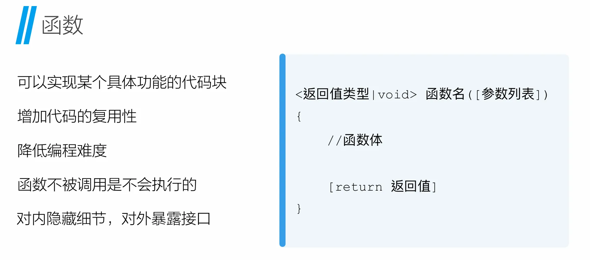

## 函数的四种形式
无参数，无返回值

```c
#include <stdio.h>
/*需求：
  计算1加到100的值并输出结果
*/

void fun()
{
	int sum = 0;
	for (int i = 1; i <= 100; i++)
	{
		sum += i;
	}
	printf("sum=%d\n", sum);
}
int main(int argc, char const* argv[])
{
	fun();
	return 0;
}
```

无参数，有返回值

```c
#include <stdio.h>
/*需求：
  计算1加到100的值，返回计算结果。
*/

int fun()
{
	int sum = 0;
	for (int i = 1; i <= 100; i++)
	{
		sum += i;
	}
	return sum;
}

int main(int argc, char const* argv[])
{
	int s = fun();

	printf("s=%d\n", s);
	printf("%d\n", fun());
	return 0;
}

```

有参数，无返回值

```c
#include <stdio.h>
/*需求：
  计算1加到的n值，并输出计算结果，n的值在调用函数时传入。
*/
void fun(int n)
{
	int sum = 0;
	for (int i = 1; i <= n; i++)
	{
		sum += i;
	}
	printf("sum=%d\n", sum);
}


int main(int argc, char const *argv[])
{
	fun(100);
	return 0;
}
```

有参数，有返回值

```c
#include <stdio.h>
/*需求：
  计算1加到n的值，返回计算结果,n的值在调用函数时传入。
*/

int fun(int n)
{
	int sum = 0;
	for (int i = 1; i <= n; i++)
	{
		sum += i;
	}
	return sum;
}


int main(int argc, char const *argv[])
{
	int s = fun(100);

	printf("s=%d\n", s);
	return 0;
}
```


# 字符串
 C 语言里**<font style="color:rgb(0, 0, 0);background-color:rgba(0, 0, 0, 0);">没有真正的 “字符串类型”</font>**，只有**<font style="color:rgb(0, 0, 0);background-color:rgba(0, 0, 0, 0);">字符数组</font>**

**<font style="color:rgb(0, 0, 0);background-color:rgba(0, 0, 0, 0);"> 字符串 = 一串字符 + 结尾的 '\0'  </font>**

+ `<font style="color:rgb(0, 0, 0);background-color:rgba(0, 0, 0, 0);">\0</font>`<font style="color:rgb(0, 0, 0);background-color:rgba(0, 0, 0, 0);"> 是</font>**<font style="color:rgb(0, 0, 0);background-color:rgba(0, 0, 0, 0);">字符串结束标志</font>**<font style="color:rgb(0, 0, 0);background-color:rgba(0, 0, 0, 0);">（ASCII 0）</font>
+ <font style="color:rgb(0, 0, 0);background-color:rgba(0, 0, 0, 0);">没有它，系统不知道字符串到哪结束</font>

<!-- 这是一张图片，ocr 内容为： -->
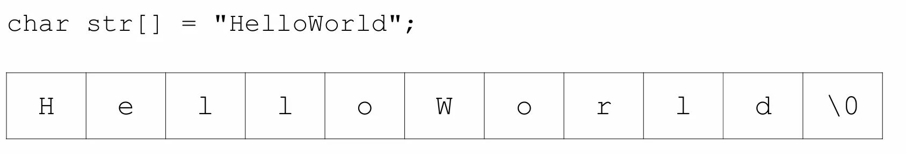

## 字符串的初始化
```c
char str[] = "HelloWorld";
char str[6] = "hello"; //长度要多留一位给 \0
char str[] = "hello"; //省略长度
char *str = "hello"; //指针写法，这种字符串不能修改内容，只能读。
```


## 字符串的输入输出
**输出用 **`<font style="color:rgb(0, 0, 0);background-color:rgba(0, 0, 0, 0);">printf</font>`** + **`<font style="color:rgb(0, 0, 0);background-color:rgba(0, 0, 0, 0);">%s</font>`

```c
#include <stdio.h>
int main() {
    char str[] = "hello";
    printf("%s\n", str);
    return 0;
}
```

**输入****<font style="color:rgb(0, 0, 0);background-color:rgba(0, 0, 0, 0);">用 scanf ("% s", 数组名)</font>**

```c
char name[20];
scanf("%s", name);
printf("你输入的是：%s\n", name);
```

<font style="color:rgb(0, 0, 0);background-color:rgba(0, 0, 0, 0);">注意：</font>

+ **<font style="color:rgb(0, 0, 0);background-color:rgba(0, 0, 0, 0);">字符串前面不用 &</font>**
+ `<font style="color:rgb(0, 0, 0);background-color:rgba(0, 0, 0, 0);">scanf</font>`<font style="color:rgb(0, 0, 0);background-color:rgba(0, 0, 0, 0);"> 遇到</font>**<font style="color:rgb(0, 0, 0);background-color:rgba(0, 0, 0, 0);">空格 / 回车就停止</font>**<font style="color:rgb(0, 0, 0);background-color:rgba(0, 0, 0, 0);">输入 </font>`<font style="color:rgb(0, 0, 0);background-color:rgba(0, 0, 0, 0);">zhang san</font>`<font style="color:rgb(0, 0, 0);background-color:rgba(0, 0, 0, 0);"> 只会读到 </font>`<font style="color:rgb(0, 0, 0);background-color:rgba(0, 0, 0, 0);">zhang</font>`

**<font style="color:rgb(0, 0, 0);background-color:rgba(0, 0, 0, 0);">想输入带空格的句子</font>**

```c
gets(str);               // 老方法，不推荐
fgets(str, 大小, stdin); // 安全
```

## <font style="color:rgb(0, 0, 0);background-color:rgba(0, 0, 0, 0);">常用字符串操作</font>
<font style="color:rgb(0, 0, 0);background-color:rgba(0, 0, 0, 0);">要使用这些函数，必须加头文件：</font>

```c
#include <string.h>
```

**<font style="color:rgb(0, 0, 0);background-color:rgba(0, 0, 0, 0);">求长度 strlen</font>**

```c
char str[] = "hello";
int len = strlen(str);  // len = 5
```

<font style="color:rgb(0, 0, 0);background-color:rgba(0, 0, 0, 0);">不算结尾的 </font>`<font style="color:rgb(0, 0, 0);background-color:rgba(0, 0, 0, 0);">\0</font>`

**<font style="color:rgb(0, 0, 0);background-color:rgba(0, 0, 0, 0);">复制 strcpy</font>**

```c
char a[20];
strcpy(a, "hello");
```

**<font style="color:rgb(0, 0, 0);background-color:rgba(0, 0, 0, 0);">拼接 strcat</font>**

```c
strcat(a, " world");
// a 变成 "hello world"
```

**<font style="color:rgb(0, 0, 0);background-color:rgba(0, 0, 0, 0);">比较 strcmp</font>**

```c
strcmp(a, b);
```

+ <font style="color:rgb(0, 0, 0);background-color:rgba(0, 0, 0, 0);">相等返回 0</font>
+ <font style="color:rgb(0, 0, 0);background-color:rgba(0, 0, 0, 0);">a < b 返回负数</font>
+ <font style="color:rgb(0, 0, 0);background-color:rgba(0, 0, 0, 0);">a > b 返回正数</font>

**<font style="color:rgb(0, 0, 0);background-color:rgba(0, 0, 0, 0);">字符串本质是数组</font>**

<font style="color:rgb(0, 0, 0);background-color:rgba(0, 0, 0, 0);">可以一个字符一个字符访问：</font>

```c
char str[] = "hello";
printf("%c", str[0]); // h
printf("%c", str[1]); // e
```

<!-- 这是一张图片，ocr 内容为： -->
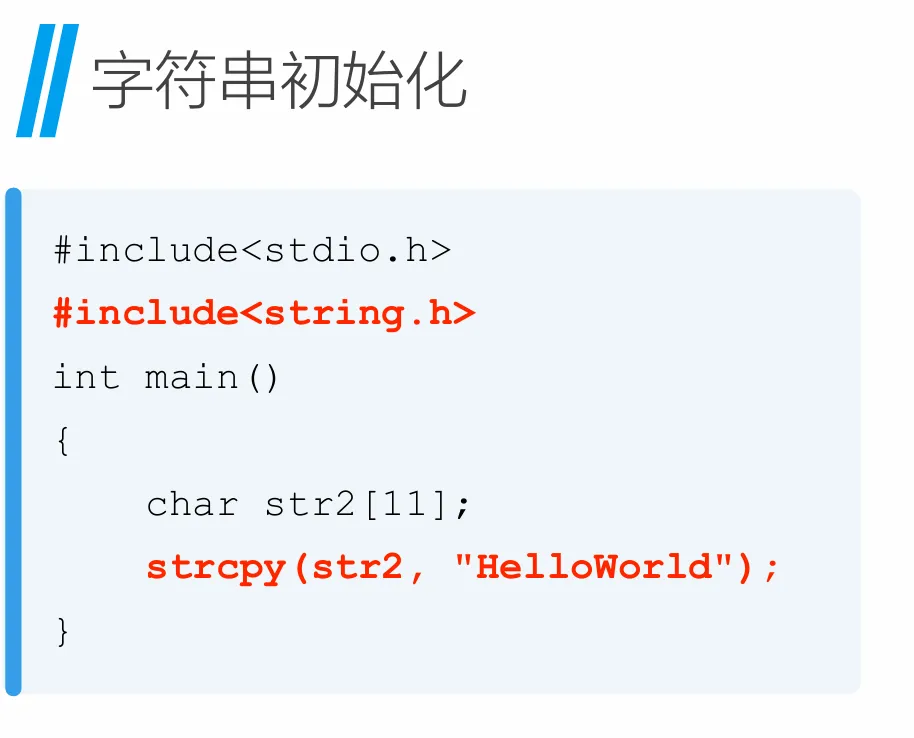

# 计算机体系结构
<!-- 这是一张图片，ocr 内容为： -->
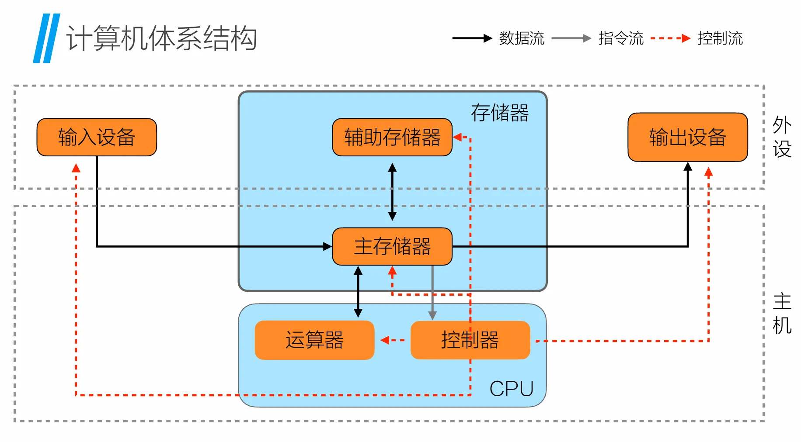

# 虚拟内存地址
<!-- 这是一张图片，ocr 内容为： -->
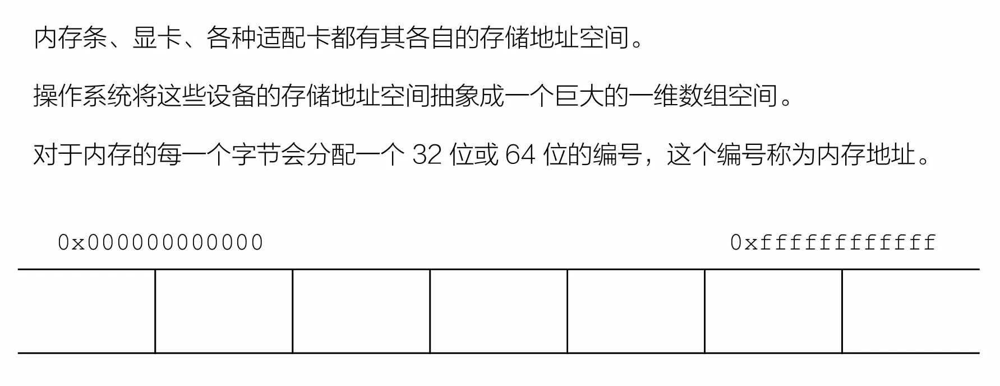

<!-- 这是一张图片，ocr 内容为： -->
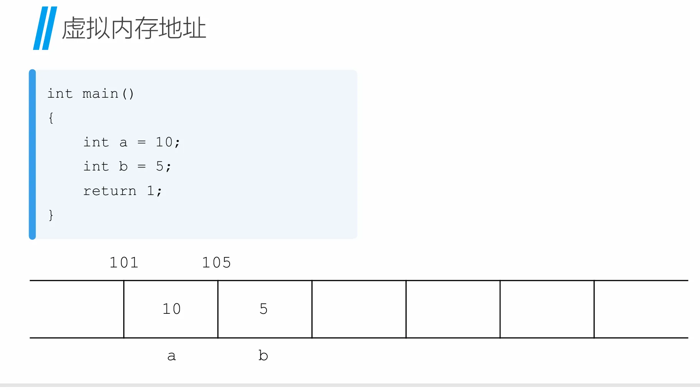

# 数组
相同数据类型的集合。 数组的长度一旦定义就不能改变。 数组中的每一个元素可以用下标表示位置，如果一个为数组中有 n 个元素， 那么下标的取值范围是 0~n-1

```c
#include <stdio.h>
int main()
{
	int a[] = {16,47,89,42,38};
    for (int i = 0; i < 5; i++)
    {
        printf("%d\n", a[i]);
    }
}
```

<!-- 这是一张图片，ocr 内容为： -->
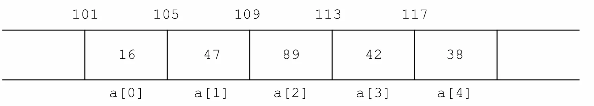

## 获取数组地址
使用取地址符 & 获取数组的地址时，返回的是数组第 0 个元素的内存地址

```c
#include <stdio.h>

int main()
{
	int a[] = {16,47,89,42,38};
	printf("%p\n", &a);
	printf("%p\n", &a[0]);
}
//输出结果相同：00000078E4CFFAA8
```

## 数组与sizeof
```c
#include <stdio.h>
int main()
{
    int a[] = {16,47,89,42,38};
    printf("%zu\n", sizeof(a));
    printf("%zu\n", sizeof(a[0]));
    int len = sizeof(a) / sizeof(a[0]);
    printf("数组⻓度为%d\n", len);
}
//输出：
//20
//4
//数组长度为5
```

# 指针
## 指针的定义
指针是用来存放内存地址的变量

## 指针的声明
```c
int a;   
//声明⼀个整型变量 
int *p;  //声明⼀个指针变量，该指针指向⼀个int类型值的内存地址
//星号 * 两边的空格无关紧要，下⾯的声明是等价的 
int* p; 
int *p; 
int * p; 
int*p;
```

## 指针的使用
```c
int a; 
int *p; 
a = 5; 
p = &a;
```

<!-- 这是一张图片，ocr 内容为： -->
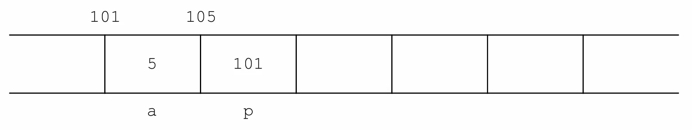

## 间接引用操作符*
间接引用操作符 * 

返回指针变量的指向地址的值

通常把这个操作叫做“解引用指针”

英文叫做 dereferencing a pointer

```c
#include <stdio.h>
int main()
{
    int a = 5;
    int* p = &a;
    printf("%d\n", *p);
    *p = 100;
    printf("%d\n", a);
}
//输出：
//5
//100
```

<!-- 这是一张图片，ocr 内容为： -->
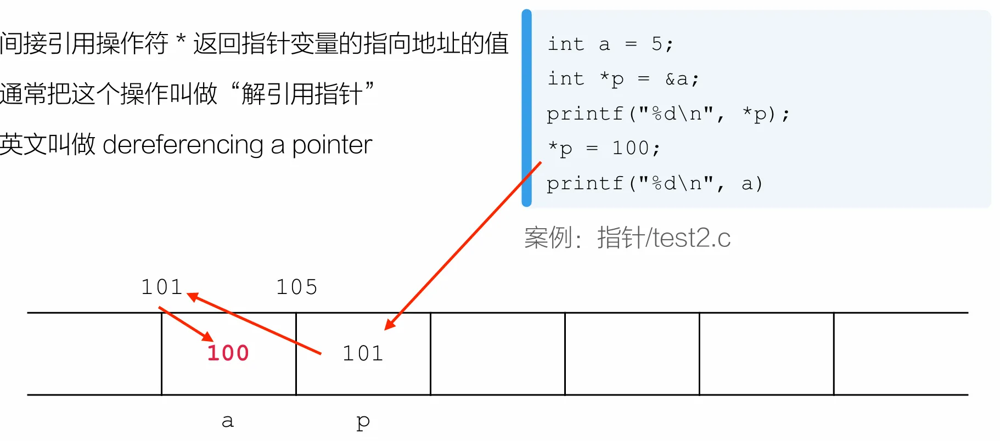

## 指针与函数
设计一个函数，传入两个int参数，并交换这两个参数的值

```c
void swap(int a, int b){
    int temp;
    temp = a;
    a = b;
    b = temp;
    printf("a=%d, b=%d\n", a, b);
} //传的是值 → 只交换函数内部的副本 → 外面的变量不变

```

```c
void swap(int *a, int *b){
    int temp;
    temp = *a;
    *a = *b;
    *b = temp;
    printf("a=%d, b=%d\n", *a, *b);
} //传的是地址（指针） → 直接修改外面的变量 → 真正交换
```

## 指针与数组
在 C 语言中，指针与数组的关系十分密切。 通过数组下标能完成的操作都可以通过指针完成。 一般来说，用指针编写的程序比用数组下标编写的程序执行速度快

```c
#include <stdio.h>
int main()
{
    int a[] = {15, 22, 67, 43, 87};
    int* p;
    p = a; //把数组名 a（也就是数组首地址）赋值给指针 p。
    printf("%p\n", a); //输出数组第一个元素的地址
    printf("%p\n", p); //输出数组第一个元素的地址
    printf("%d\n", *p); //*p = 地址里的值（15）
}
```

```c
#include <stdio.h>
int main()
{
    int a[] = {15, 22, 67, 43, 87};
    int* p;
    p = a;
    for (int i = 0; i < sizeof(a) / sizeof(a[0]); i++) {
        printf("%d\n", a[i]);
    }
    for(int i = 0; i < sizeof(a) / sizeof(a[0]); i++) {
        printf("%d\n", *(p + i));
    }
}
//两个方法都能正确输出数组
```

## 指针做算术运算
给指针加上一个整数，实际上加的是这个整数和指针数据类型对应字节数的乘积

```c
#include <stdio.h>
int main()
{
    int a = 5;
    int* p = &a;
    printf("%p\n", p); // 打印 p 存的地址
    printf("%d\n", *p); // 打印 p 指向的值（5）
    p++;               // 指针向后移动一步
    printf("%p\n", p); // 打印移动后的地址
    printf("%d\n", *p);// 打印移动后指向的值（未被定义是随机垃圾值）
    return 0;
}
/*
指针 p++ 不是 + 1，是 + 类型大小
int* → +4
char* → +1
double* → +8
*/
```

# 各数据类型字节数
<!-- 这是一张图片，ocr 内容为： -->
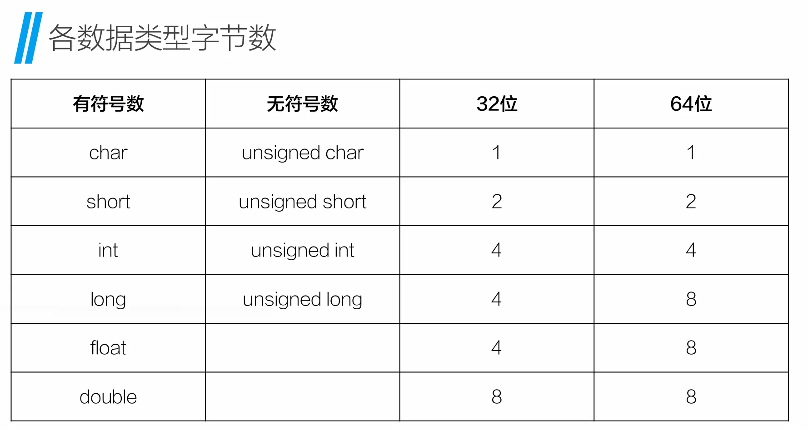

# 结构体
结构体是一个或多个变量的集合，这些变量可以是不同的类型

<!-- 这是一张图片，ocr 内容为： -->
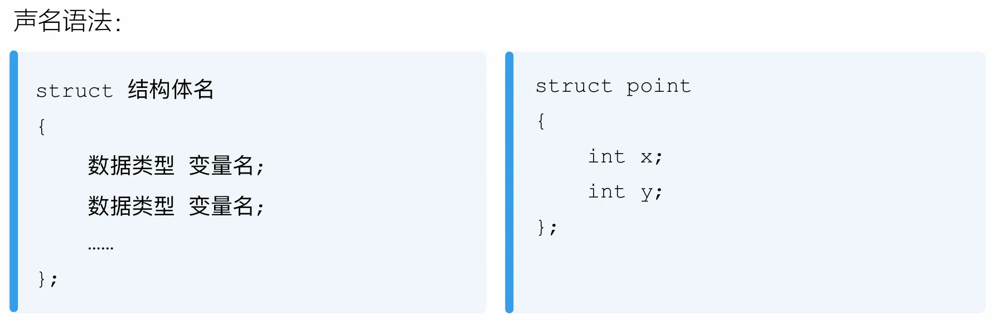

## 结构体的初始化和调用
<!-- 这是一张图片，ocr 内容为： -->
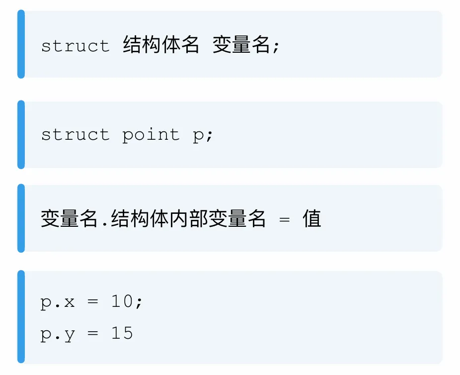

## 结构体实例-创建一个point
编写一个函数，传入两个int参数，在函数创建一个结构体point类型的变量， 将传入的两个参数分别赋值给该结构体变量的x和y，最后将该结构体变量返回

<!-- 这是一张图片，ocr 内容为： -->
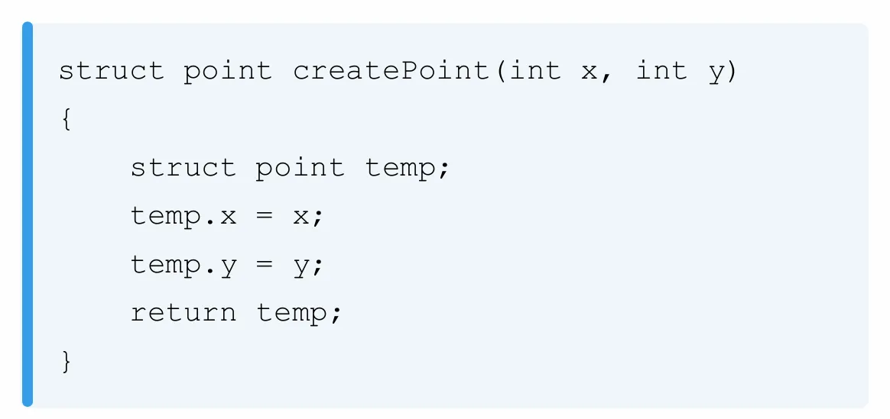

## 结构体与指针
在一些场景中，如果传递给函数的结构体很大，使用指针方式的效率通常更高

<!-- 这是一张图片，ocr 内容为： -->
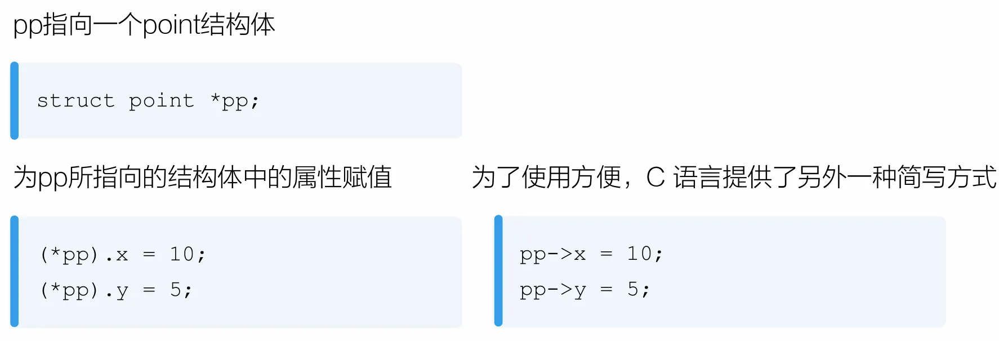

## 类型定义
每次声明结构体变量都要写 struct 关键 字，很麻烦，而且逻辑上也很难受，typedef 可以解决这个问题

<!-- 这是一张图片，ocr 内容为： -->
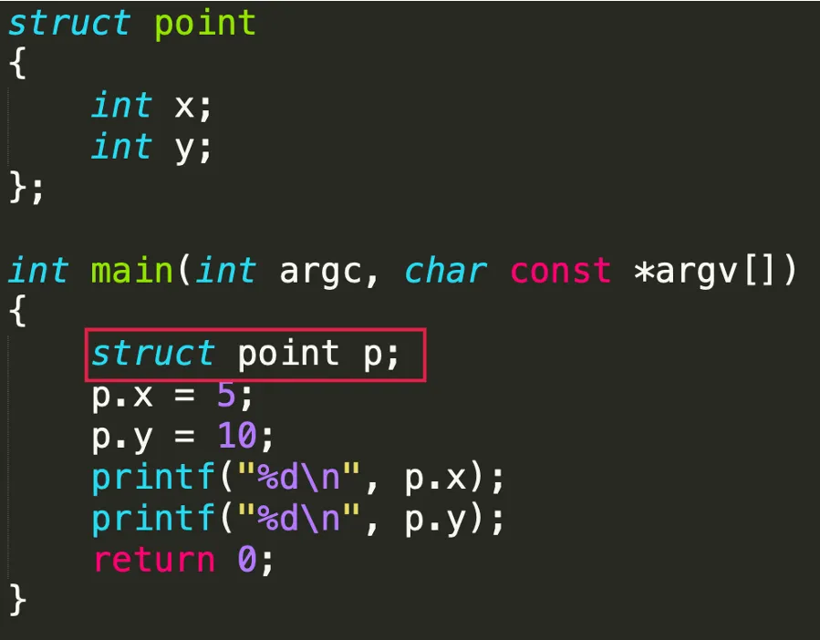

<!-- 这是一张图片，ocr 内容为： -->
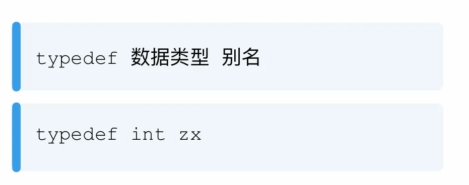

<!-- 这是一张图片，ocr 内容为： -->
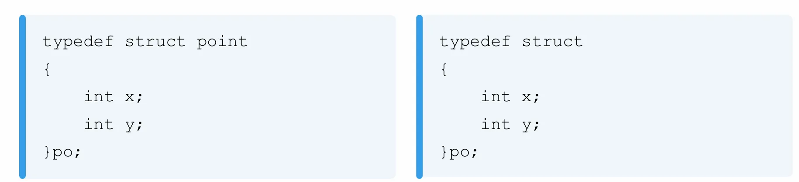<!-- 这是一张图片，ocr 内容为： -->
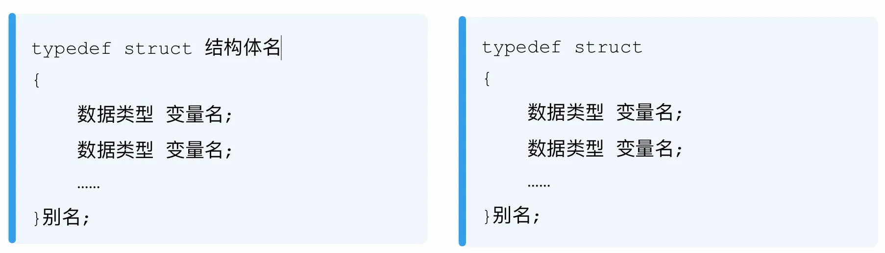


# 内存分类
C 程序编译后，会以**三种形式**使用内存：

**静态 / 全局内存**

静态声明的变量和全局变量使用这部分内存，这些变量在程序开始运行时分配，直到程序终才消失。  
**自动内存（栈内存）**

函数内部声明的变量使用这部分内存，在函数被调用时才创建。

**动态内存（堆内存）**

根据需求编写代码动态分配内存，可以编写代码释放，内存中的内容直到释放才消失。


# 动态内存分配
在C语言中，动态分配内存的基本步骤：

**1. 使用 malloc （memory allocate）函数分配内存** 

+ void* malloc(size_t) 
+ 如果成功，会返回从堆内存上分配的内存指针 
+ 如果失败，会返回空指针

**2. 使用分配的内存**

**3. 使用 free 函数释放内存**

## 动态内存分配示例-基本数据类型
```c
#include <stdio.h>
#include <stdlib.h>
int main(int argc, char const *argv[])
{
    int* p;
    p = (int*)malloc(sizeof(int));
    /*
    malloc(size)：申请 size 字节的堆内存
    sizeof(int)：int 的大小，一般是 4 字节
    (int*)：把 malloc 返回的地址强转成 int* 类型
    最后把申请到的内存地址赋值给 p
    */
    *p = 15;
    printf("%d\n", *p); //15
    free(p);
    return 0;
}
```

## 动态内存分配示例-字符串
```c
#define _CRT_SECURE_NO_WARNINGS // 使用VS2022要加
#include <stdio.h>
#include <stdlib.h>
#include <string.h>
int main(int argc, char const *argv[])
{
    char* s;
    s = (char*)malloc(10);
    strcpy(s, "Hello");
    printf("%s\n", s);
    free(s);
    return 0;
}
```

## 动态内存分配示例-数组
```c
#include <stdio.h>
#include <stdlib.h>
#include <string.h>
int main(int argc, char const *argv[])
{
    int* arr = (int*)malloc(5 * sizeof(int));
    for (int i = 0; i < 5; i++) {
        arr[i] = 0;
    }

    for (int i = 0; i < 5; i++) {
        printf("%d\n", arr[i]);
    }
    return 0;
}
```

## 动态内存分配示例-结构体
```c
#include <stdio.h>
#include <stdlib.h>
#include <string.h>

typedef struct
{
    int x;
    int y;
}po;

int main(int argc, char const *argv[])
{
    po* p;
    p = (po*)malloc(sizeof(po));
    p->x = 5;
    p->y = 10;
    printf("%d\n", p->x);
    printf("%d\n", p->y);
    return 0;
}
```

